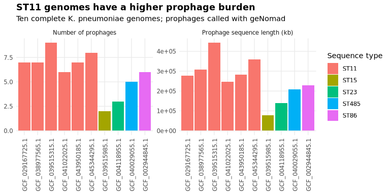
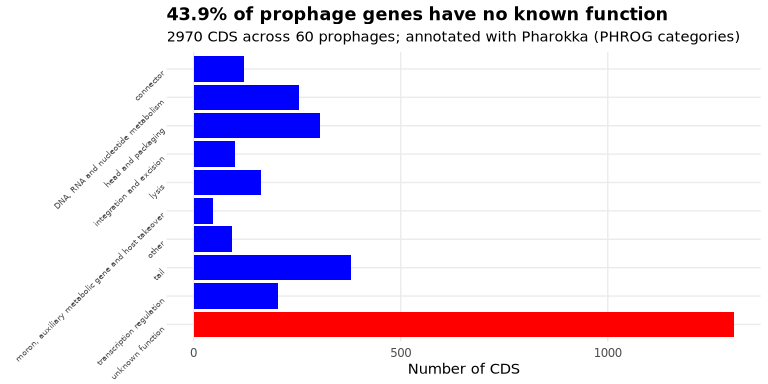
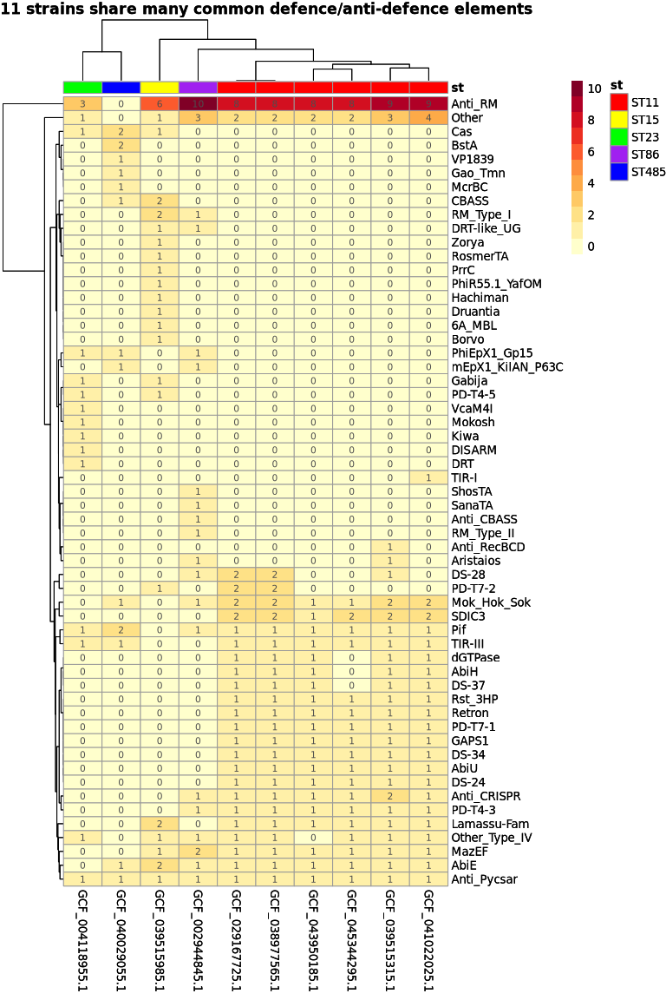
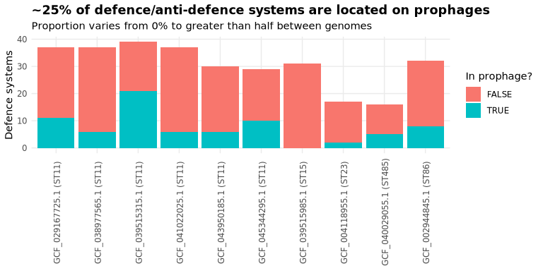
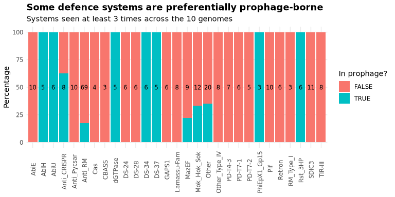

Analysis of prophages in 10 Klebsiella pneumoniae genomes
================
Eden Black

10 *Klebsiella pneumoniae* genomes isolated in Nanchang, China were
chosen for analysis. 6 of the genomes are from the dominant ST11 strain
(which accounts for 60% of infections in China (Zhang *et al*, 2017))
and one each of the other four strain types with NCBI entries for
isolates from Nanchang. With one genome per lineage for these STs,
statistical testing is not plausible - this is instead a descriptive
analysis.

``` r
samples <- read_tsv(here("results", "tables", "samples.tsv"))
prophages <- read_tsv(here("results", "tables", "prophages.tsv"))

# First 1000 rows of CARD are N/A, so read_tsv assigns boolean type by default
# Fix with guess_max = Inf
prophage_genes <- read_tsv(here("results", "tables", "prophage_genes.tsv"),
                           guess_max = Inf)
defence_systems <- read_tsv(here("results", "tables", "defense_systems.tsv"))
defence_genes <- read_tsv(here("results", "tables", "defense_genes.tsv"))

# Treat strain as a factor and order by lineage
samples <- samples |>
  mutate(st = factor(paste0("ST", st))) |>
  arrange(st, sample) |>
  mutate(sample = fct_inorder(sample))

#Table for looking up strain of each sample
st_lookup <- select(samples, sample, st)
```

``` r
prophage_size <- prophages |>
  group_by(sample) |>
  summarise(prophage_bp = sum(length), .groups = "drop")

burden <- samples |>
  left_join(prophage_size, by = "sample") |>
  select(sample, st, n_prophages, n_prophage_cds, prophage_bp)

burden
```

<div class="kable-table">

| sample          | st    | n_prophages | n_prophage_cds | prophage_bp |
|:----------------|:------|------------:|---------------:|------------:|
| GCF_029167725.1 | ST11  |           7 |            318 |      278478 |
| GCF_038977565.1 | ST11  |           7 |            394 |      306941 |
| GCF_039515315.1 | ST11  |           9 |            428 |      443011 |
| GCF_041022025.1 | ST11  |           6 |            305 |      245672 |
| GCF_043950185.1 | ST11  |           7 |            363 |      283814 |
| GCF_045344295.1 | ST11  |           8 |            368 |      359701 |
| GCF_039515985.1 | ST15  |           2 |            105 |       76767 |
| GCF_004118955.1 | ST23  |           3 |            163 |      138080 |
| GCF_040029055.1 | ST485 |           5 |            272 |      209454 |
| GCF_002944845.1 | ST86  |           6 |            254 |      228070 |

</div>

Table 1: Summary of the sequence type and prophage levels of each *K.
pneumoniae* genome

``` r
burden_long <- burden |>
  select(sample, st, `Number of prophages` = n_prophages,
         `Prophage sequence length (kb)` = prophage_bp) |>
  pivot_longer(c(`Number of prophages`, `Prophage sequence length (kb)`))


p_burden <- ggplot(burden_long, aes(x = fct(sample), y = value, fill = st)) +
  geom_col() +
  facet_wrap(~name, scales = "free") +
  labs(title = "ST11 genomes have a higher prophage burden",
    subtitle = "Ten complete K. pneumoniae genomes; prophages called with geNomad",
    x = NULL, y = NULL, fill = "Sequence type"
  ) +
  theme(axis.text.x = element_text(angle = 90, hjust = 0.4, vjust = 0.6))

p_burden
```


Figure 1: Bar chart of the number of prophages (left) and the combined
sequence length of prophages (right) in each *K. pneumoniae* genome
<br><br>

The plots show an expected strong correlation between the number of
prophages in a bacterial genome and the sequence length of the
prophages. More interestingly, all isolates of the ST11 sequence type
contained as many or more integrated prophages as the ST86 isolate,
which contained the most prophages of any of the other sequence types.
ST11 frequently displays AMR characteristics (Zhang *et al*, 2017),
often encoded by prophage morons. To investigate, the prophage gene
information from pharokka was examined.

``` r
categories <- prophage_genes |>
  mutate(category = replace_na(category, "unknown function"),
         category = as.factor(category)) |>
  count(category, sort = TRUE) |>
  mutate(percent = round(100 * n / sum(n), 1))

categories
```

<div class="kable-table">

| category                                          |    n | percent |
|:--------------------------------------------------|-----:|--------:|
| unknown function                                  | 1304 |    43.9 |
| tail                                              |  381 |    12.8 |
| head and packaging                                |  304 |    10.2 |
| DNA, RNA and nucleotide metabolism                |  254 |     8.6 |
| transcription regulation                          |  203 |     6.8 |
| lysis                                             |  163 |     5.5 |
| connector                                         |  121 |     4.1 |
| integration and excision                          |  100 |     3.4 |
| other                                             |   92 |     3.1 |
| moron, auxiliary metabolic gene and host takeover |   48 |     1.6 |

</div>

Table 2: Prophage gene categories

``` r
p_categories <- ggplot(categories, aes(y = fct_rev(category), x = n,
                                       fill = category == "unknown function")) +
  geom_col(show.legend = FALSE) +
  scale_fill_manual(values = c("TRUE" = "red", "FALSE" = "blue")) +
  labs(title = "43.9% of prophage genes have no known function",
       subtitle = sprintf("%d CDS across %d prophages; annotated with Pharokka (PHROG categories)",
                          nrow(prophage_genes), nrow(prophages)),
       y = NULL, x = "Number of CDS") +
  theme(axis.text.y = element_text(angle = 45, hjust = 1, vjust = 1,
                                   size = 6))

p_categories
```


Figure 2: Bar chart of the number of genes across the 10 combined
genomes assigned to each category by PHROG <br><br>

The category with the most genes by far was **unknown function**,
accounting for 43.9% of the identified coding DNA sequences. This is not
unexpected, and highlights the importance of homology, structure
prediction, and functional prediction tools in phage bioinformatics - a
huge portion of the genome is uncharacterised. The category with the
fewest CDS was **moron, auxiliary metabolic gene and host takeover**,
with just 48 genes across the 10-genome sample, or 1.6% of CDS. The
genes in this category are strong candidates for investigation regarding
non-defence/antidefence methods of host manipulation, which may be
investigated at a later time.

The next step was the investigation of defence and anti-defence
elements.

``` r
count(defence_systems, activity)
```

<div class="kable-table">

| activity    |   n |
|:------------|----:|
| Antidefense | 109 |
| Defense     | 196 |

</div>

Table 3: Counts of defence and anti-defence genes in the sample

``` r
count_systems <- defence_systems |>
  count(type, sort = TRUE)

head(count_systems, 10)
```

<div class="kable-table">

| type        |   n |
|:------------|----:|
| Anti_RM     |  69 |
| Other       |  20 |
| Mok_Hok_Sok |  12 |
| SDIC3       |  11 |
| AbiE        |  10 |
| Anti_Pycsar |  10 |
| Pif         |  10 |
| MazEF       |   9 |
| Anti_CRISPR |   8 |
| Lamassu-Fam |   8 |

</div>

Table 4: 10 most common types of defence and anti-defence systems in the
sample

``` r
defence_by_genome <- defence_systems |>
  left_join(st_lookup, by = "sample") |>
  count(type, st, sample) |>
  arrange(st) |>
  select(c(-st))

defence_heatmap_matrix <- defence_by_genome |>
  pivot_wider(names_from = sample, values_from = n, values_fill = 0) |>
  column_to_rownames("type") |>
  as.matrix()

st_colours <- c(
  ST11 = "red",
  ST15 = "yellow",
  ST23 = "green",
  ST86 = "purple",
  ST485 = "blue"
)

annotation_columns <- mutate(st_lookup, sample = as.character(sample)) |>
  column_to_rownames("sample")
annotation_colours <- list(st = st_colours)
maxn <- max(defence_heatmap_matrix)

defence_heatmap <- pheatmap(
  defence_heatmap_matrix,
  color = colorRampPalette(brewer.pal(9, "YlOrRd"))(maxn + 1),
  breaks = seq(-0.5, maxn + 0.5, by = 1),
  annotation_col = annotation_columns,
  annotation_colors = annotation_colours,
  display_numbers = TRUE,
  number_format = "%d",
  main = "ST11 strains share many common defence/anti-defence elements"
)

defence_heatmap
```


Figure 3: Heatmap showing the number of defence/anti-defence systems of
different types in each sample, clustered by ST <br><br>

The ST-level clustering is visually apparent, with a group of ~20
systems at the bottom of the heatmap being near-ubiquitous in ST11
samples but mostly absent from the others. By far the most common type
of element identified by DefenseFinder was anti-RM, an anti-defence
mechanism which allows for the evasion of the prokaryotic
restriction-modification immune component, which uses restriction
enzymes to cut unmethylated foreign DNA while host DNA is protected by
methylation (Kang *et al*, 2025). As such, anti-RM capability is a
driver of horizontal gene transfer (Dimitriu *et al*., 2024). Only the
single ST485 strain contained no identified anti-RM system; meanwhile,
every ST11 sample in the cohort carried 8 or 9 identified anti-RM
systems.

The next investigative step was to evaluate which of these were located
on prophages.

``` r
locations <- defence_systems |>
  count(in_prophage) |>
  mutate(pct = round(100 * n / sum(n), 1))

locations
```

<div class="kable-table">

| in_prophage |   n |  pct |
|:------------|----:|-----:|
| FALSE       | 230 | 75.4 |
| TRUE        |  75 | 24.6 |

</div>

Table 5: Number of defence systems across the sample which are located
in prophages

``` r
per_sample_location <- defence_systems |>
  left_join(st_lookup, by = "sample") |>
  count(sample, st, in_prophage) |>
  arrange(st) |>
  mutate(sample = fct_inorder(sample))

p_location_sample <- ggplot(per_sample_location, aes(x = sample, y = n, fill = in_prophage)) +
  geom_col() +
  labs(title = "~25% of defence/anti-defence systems are located on prophages",
       subtitle = "Proportion varies from 0% to greater than half between genomes",
       x = NULL, y = "Defence systems", fill = "In prophage?") +
  scale_x_discrete(labels = function(x) paste0(x, " (", st_lookup$st[match(x, st_lookup$sample)], ")")) +
  theme(axis.text.x = element_text(angle = 90, hjust = 0.4, vjust = 0.6))

p_location_sample
```


Figure 4: Bar chart showing the number of defence/anti-defence systems
which are located on prophages in each genome <br><br>

Interestingly, while the ST11 samples held many systems in common
(figure 3), GCF_039515315.1 has more than half of these located on
geNomad-identified prophages, while that fraction is less than a third
in the other ST11 samples. This aligns well with the prophage summary
data assessed earlier, which showed that GCF_039515315.1 had the most
prophages, the most prophage genes, and the longest combined prophage
sequences (figure 1). The single ST15 sample, on the other hand, showed
no identified systems as being located on prophages. This was
unexpected; this sample contained 6 anti-RM systems, commonly associated
with prophages. This gives rise to another question: which system types
are most prophage-bound?

``` r
per_type_location <- defence_systems |>
  count(type, in_prophage) |>
  group_by(type) |>
  mutate(total = sum(n), pct = round(100 * n / sum(n), 1)) |>
  ungroup() |>
  filter(total >= 3)

totals <- distinct(per_type_location, type, total)

p_location_type <- ggplot(per_type_location,
                          aes(x = type, y = pct, fill = in_prophage)) +
  geom_col() +
  geom_text(data = totals, aes(x = type, y = 50, label = total),
            inherit.aes = FALSE, size = 3, colour = "black") +
  labs(title = "Some defence systems are preferentially prophage-borne",
       subtitle = "Systems seen at least 3 times across the 10 genomes",
       x = NULL, y = "Percentage", fill = "In prophage?") +
  theme(axis.text.x = element_text(angle = 90, hjust = 0.6, vjust = 0.6))

p_location_type
```


Figure 5: Fill chart showing the percentage of each
DefenseFinder-identified system type located on prophages. The number
represents the total systems of that type detected. <br><br>

Against my earlier expectations, only around 20% of the numerous
identified anti-RM systems were prophage-borne. 7 total system types
were seen 3 or more times exclusively on prophages: AbiH, AbiU, dGTPase,
DS-34, DS-37, PhiEpX1_Gp15, and Rst_3HP. One system type which stands
out as being preferentially, but not exclusively, prophage-borne is
anti-CRISPR systems. As CRISPR is an anti-viral defence element, it
could be expected that anti-CRISPR elements would be seen exclusively in
viral genomes. The 3 anti-CRISPR systems not localised to a prophage are
therefore most likely indicative of cryptophages not recognised by
geNomad, either from ancestral infection or integrated as part of mobile
genetic element during horizontal gene transfer. As geNomad identifies
phages via marker composition, it is plausible that these genes are
located on phages which have lost too many structural and replication
genes to be identified, such as the “uncharacteristic genomic regions”
identified by de Sousa *et al*. (2026). However, anti-CRISPR proteins
are also found on plasmids (Samuel *et al*., 2024), which is also a
possibility for these systems.

The final step of this mini-analysis was to check the pharokka CARD and
VFDB hits to see if prophages in these samples are acting as vehicles
for AMR genes or virulence factors.

``` r
amr <- prophage_genes |> filter(!is.na(CARD_hit), CARD_hit != "None")
vf  <- prophage_genes |> filter(!is.na(vfdb_hit),  vfdb_hit  != "None")

cat(sprintf("\n--- Cargo ---\nAMR hits (CARD): %d\nVirulence hits (VFDB): %d\n",
            nrow(amr), nrow(vf)))
```

    ## 
    ## --- Cargo ---
    ## AMR hits (CARD): 3
    ## Virulence hits (VFDB): 0

``` r
select(amr, sample, prophage, CARD_short_name,
       AMR_Gene_Family, Resistance_Mechanism, Drug_Class)
```

<div class="kable-table">

| sample | prophage | CARD_short_name | AMR_Gene_Family | Resistance_Mechanism | Drug_Class |
|:---|:---|:---|:---|:---|:---|
| GCF_045344295.1 | NZ_CP174249.1\|provirus_3122878_3144659 | sul1 | sulfonamide resistant sul | antibiotic target replacement | sulfonamide antibiotic_sulfone antibiotic |
| GCF_045344295.1 | NZ_CP174249.1\|provirus_3122878_3144659 | qacEdelta1 | major facilitator superfamily (MFS) antibiotic efflux pump | antibiotic efflux | disinfecting agents and antiseptics |
| GCF_045344295.1 | NZ_CP174249.1\|provirus_3122878_3144659 | aadA2 | ANT(3’’) | antibiotic inactivation | aminoglycoside antibiotic |

</div>

Table 6: AMR genes detected on prophages by pharokka <br><br>

No prophage-borne virulence factors were detected; three prophage-borne
AMR factors were, all on a single prophage (NZ_CP174249.1) in a single
sample (GCF_045344295.1). This was one of the ST11 samples. Two of the
detected genes, *sul1* and *qacE\$Delta\$1*, are characteristic of class
1 integrons (Gillings *et al*., 2008), and aadA2 is an aminoglycoside
adenylyltransferase cassette commonly found in the variable regions of
class 1 integrons, including in clinical K. pneumoniae isolates from
China (Yang *et al*., 2013). Entire integrons have been found in phage
genomes (Qi *et al*., 2023), meaning it is possible that the distinctive
integron AMR genes detected in this sample were in fact phage-borne.

## Conclusions

Across ten complete K. pneumoniae genomes from Nanchang, geNomad
identified 60 prophages, ranging from two to nine per genome. Prophage
cargo was dominated by genes of unknown function (43.9% of 2,970 CDS),
with structural categories accounting for most of the remainder and
host-manipulation morons for only 1.6%. DefenseFinder detected 305
defence and anti-defence systems, of which approximately a quarter were
prophage-encoded. This proportion ranged from more than half in one ST11
genome to none in the ST15 isolate. The ST15 result is notable; the
isolate carried 31 identified defence/anti-defence systems overall,
comparable to the rest of the cohort, despite receiving none from
prophages and having the lowest prophage content overall. This strain
assembled a comparable immune repertoire without prophage-borne cargo;
while a large share of bacterial immune repertoires are mobile and
horizontally acquired, prophages are one vehicle for this process among
several. Prophage-borne AMR was rare in this cohort, and no
prophage-borne virulence factors were detected.

This analysis is limited by size and structure. While efforts were made
to examine multiple ST11 isolates from different studies, the fact that
all were sourced in Nanchang means that recent shared ancestry is
possible and cannot be assumed to be independent. Scaling this analysis
to the thousands of genomes required for association testing would
require explicit correction for population structure. In addition,
geNomad was used with neural network classification disabled due to
limitations of the hardware being used to perform the analysis, meaning
prophage classification was limited to the use of markers, rather than
also using nucelotide sequence classification and combining the results.
Ideally, geNomad would be complimented by an explicit *att*-site
identification approach, which can delineate elements more precisely.
Furthermore, the struggle to detect cryptophages mean the content
identified here should be considered a lower bound.

Natural extensions of the findings here include functional annotation
for the 43.9% of uncharacterised genes using remote homology or
structural methods; resolving whether the class 1 integron signature
genuinely represents prophage cargo or is an artefact by looking closer
at the scores or manually inspecting the locus; and (on a grander scale)
comparing prophage content between much larger numbers of closer- and
more distantly-related genomes to determine the extent to which prophage
content tracks bacterial lineage.

## References

Shuttling, swapping and mixing: the rapid modular evolution of antiviral
repertoires in temperate phages and their satellites Jorge Moura de
Sousa, Florence Depardieu, Marie Touchon, Raphaël Laurenceau, Kristen
Curry, Alice Maestri, Florian Tesson, Arthur Loubat, Rayan Chikhi, Jean
Cury, Aude Bernheim, David Bikard, Eduardo P.C. Rocha bioRxiv
2026.02.27.708500; doi: <https://doi.org/10.64898/2026.02.27.708500>

Dimitriu, T., Szczelkun, M. D., & Westra, E. R. (2024). Various plasmid
strategies limit the effect of bacterial restriction-modification
systems against conjugation. Nucleic acids research, 52(21),
12976–12986. <https://doi.org/10.1093/nar/gkae896>

Gillings, M., Boucher, Y., Labbate, M., Holmes, A., Krishnan, S.,
Holley, M., & Stokes, H. W. (2008). The evolution of class 1 integrons
and the rise of antibiotic resistance. Journal of bacteriology, 190(14),
5095–5100. <https://doi.org/10.1128/JB.00152-08>

Kang, H., Gao, A., & Zhu, Y. (2025). Bacterial restriction-modification
systems: mechanisms of defense against phage infection. Biophysics
reports, 11(5), 330–343. <https://doi.org/10.52601/bpr.2025.240070>

Li, B., Hu, Y., Wang, Q., Yi, Y., Woo, P. C., Jing, H., Zhu, B., & Liu,
C. H. (2013). Structural diversity of class 1 integrons and their
associated gene cassettes in Klebsiella pneumoniae isolates from a
hospital in China. PloS one, 8(9), e75805.
<https://doi.org/10.1371/journal.pone.0075805>

Qi, Q., Rajabal, V., Ghaly, T. M., Tetu, S. G., & Gillings, M. R.
(2023). Identification of integrons and gene cassette-associated
recombination sites in bacteriophage genomes. Frontiers in microbiology,
14, 1091391. <https://doi.org/10.3389/fmicb.2023.1091391>

Samuel, B., Mittelman, K., Croitoru, S. Y., Ben Haim, M., & Burstein, D.
(2024). Diverse anti-defence systems are encoded in the leading region
of plasmids. Nature, 635(8037), 186–192.
<https://doi.org/10.1038/s41586-024-07994-w>

Zhang, R., Liu, L., Zhou, H., Chan, E. W., Li, J., Fang, Y., Li, Y.,
Liao, K., & Chen, S. (2017). Nationwide Surveillance of Clinical
Carbapenem-resistant Enterobacteriaceae (CRE) Strains in China.
EBioMedicine, 19, 98–106. <https://doi.org/10.1016/j.ebiom.2017.04.032>
